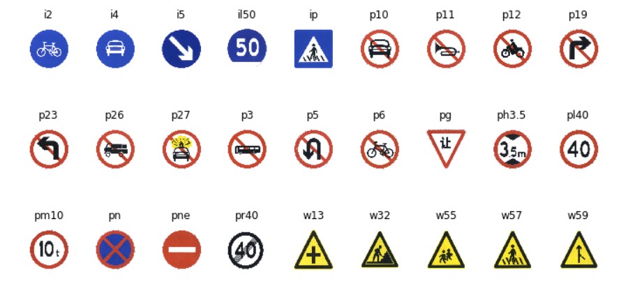
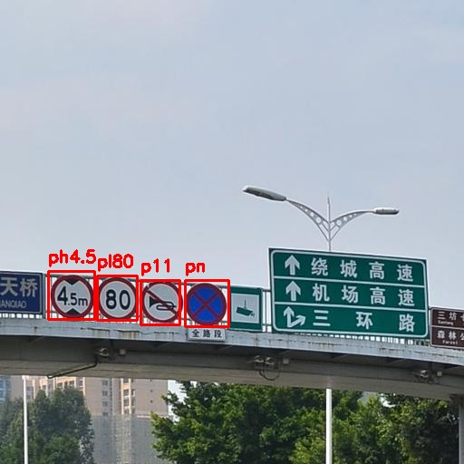
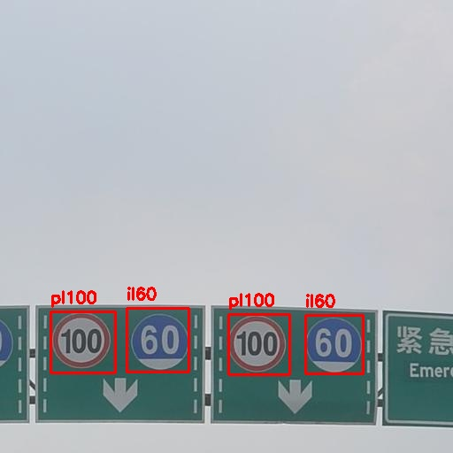
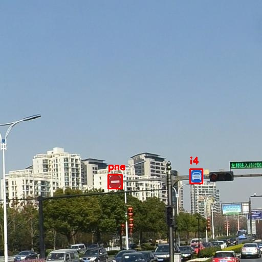
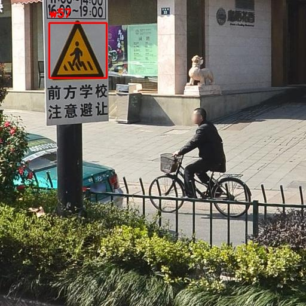
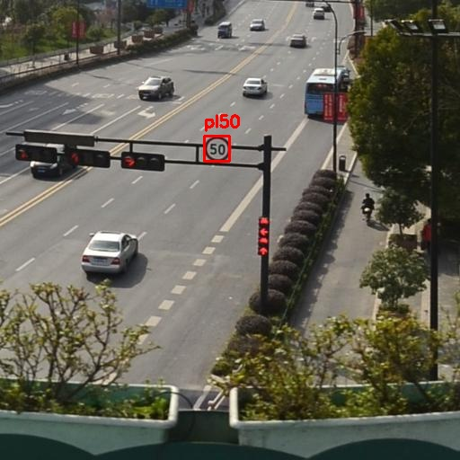
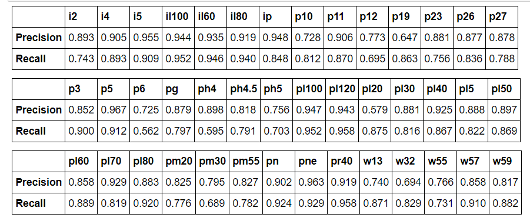
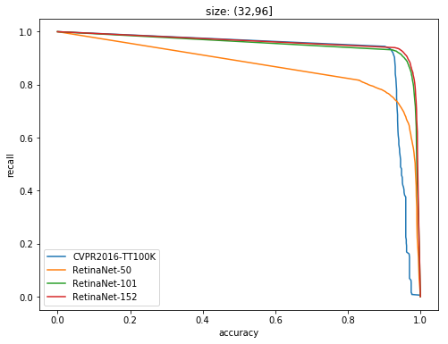
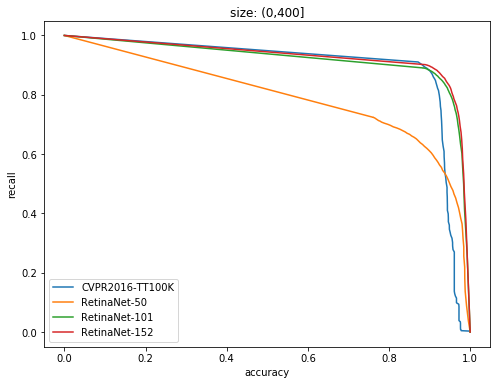

# Simultaneous Traffic Sign Detection and Classification with RetinaNet

## Overview
In this project, I implement an one-stage detection and classification model based on this paper 
[Focal Loss for Dense Object Detection](https://arxiv.org/pdf/1708.02002.pdf), to detect and classify traffic signs. This model was trained on the [Tsinghua_Tecent_100K](http://cg.cs.tsinghua.edu.cn/traffic-sign/) Dataset. After carefully model tuning, the RetinaNet finally achieved 90 MAP on 42 classes traffic signs on the test dataset, which is better than previous benchmarks.

* [Traffic-Sign Detection and Classification in the Wild](https://www.cv-foundation.org/openaccess/content_cvpr_2016/papers/Zhu_Traffic-Sign_Detection_and_CVPR_2016_paper.pdf)
* [TAD16K: An enhanced benchmark for autonomous driving](https://sigport.org/sites/default/files/docs/ICIP2017_poster_5.pdf)

 Visualization results show this model works well for traffic signs in various sizes and prospectives.







## Dependencies
* Python 2.7+
* Pytorch 0.3.0+
* PIL
* OpenCV-Python
* Numpy
* Matplotlib

## How to run

### To run predictions on pre-trained models
* Clone this repository
* Download the pretrained model [here](https://pan.baidu.com/s/1mafO6ldO5Fj95VM-34IeoQ)
* ```python test.py -m demo```
    * This will run inference on images from /samples, you can also put your own images into this directory to run inference.
* ```python test.py -m valid```
    * This will run inference on the entire valid dataset and output the evaluation result.You can change the backbone model by -backbone flag. See the code for details.

### To run a traning experiment from scratch
* The training and testing dataset I used can be downloaded [here](https://pan.baidu.com/s/1bgJlc6qVanJAtxAKGTerGg)
* Save the training and valid dataset into the /data directory
* ```python train.py -exp model```
    * This will train the RetinaNet model from scratch. You can change the parameters easily in the config.py file and use similar ways to train your own dataset. The flag model specify the directory to save your model. See the code for more details.
    

## Difference between original RetinaNet implementations
* All the parameters are carefully tuned to fit the need for Traffic sign detection. Please note that the size and number of anchors are extremely important for the following steps. We must ensure all detectable targets can be illuminated by at least one anchor. The size of traffic signs in the dataset ranges from [10, 500]. See `encode.py` for more details. 

* The original images in the Tsinghua_Tecent_100K dataset is very large(2048×2048), which is extremely memory-consuming to train. So I cropped the images to 512×512 pixels and implemented slight data augmentation on the training set. All the classes appeared less than 100 times in the dataset were omitted and there are 42 classes left. Classes appeared less than 1000 times were manually augmented to have approximate 1000 samples. Augmentation methods included random crop, illumination change and contrast change. The final training dataset contains 37,212 images. 

* I use the [Group Normalization](https://arxiv.org/pdf/1803.08494.pdf) to accelerate the training process. Since the ResNet+RetinaNet model is a very large neural network,only very small batch size(eg. 4,8) can be used on a common GPU. According Yuxin Wu,Kaiming He's paper, Group Normalization performs better in such situations. 

## Training process
All the models were trained on two GTX-1080Ti GPU for 18 epochs with batch size of 8. I use Adam Optimizer with learning rate 1e-4 and the learning rate was decayed to 1e-5 for the last 6 epochs. It generally takes 20 hours for a RetinaNet model to converge.

## Performance

 As shown below, the RetinaNet-101 and RetinaNet-152 models achieve 92.03 and 92.80 MAP on the Tsinghua_Tecent_100K dataset respectively, which outperform the previous benchmark for simultanous traffic sign detection and classification. See `evaluate/eval_check.ipynb` for more details.
 
 
  Models | CVPR-2016 TT100K | RetinaNet-50| RetinaNet-101 |RetinaNet-152
-------- |:----------------:| :-----------: | :-------------: | :------------:
MAP | 0.8979 | 0.7939 | 0.9203 | 0.9280 




 
 


## Reference
* [1.Focal Loss for Dense Object Detection](https://arxiv.org/pdf/1708.02002.pdf)
* [2.Traffic-Sign Detection and Classification in the Wild](https://www.cv-foundation.org/openaccess/content_cvpr_2016/papers/Zhu_Traffic-Sign_Detection_and_CVPR_2016_paper.pdf)
* [3.TAD16K: An enhanced benchmark for autonomous driving](https://sigport.org/sites/default/files/docs/ICIP2017_poster_5.pdf)
* [4.Group Normalization](https://arxiv.org/pdf/1803.08494.pdf)
* [5.andreaazzini's implementation](https://github.com/andreaazzini/retinanet.pytorch)
* [6.fizyr's implementation](https://github.com/fizyr/keras-retinanet)


```python

```
